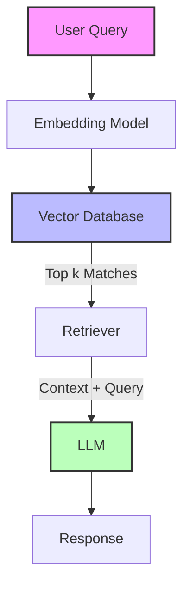

# RAG Fundamentals Content Generator

Generate **comprehensive educational content** for Retrieval Augmented Generation (RAG) topics when the user provides a topic.

**Supported Topics:**
- Vector Databases (Pinecone, Weaviate, Chroma, Qdrant)
- Embeddings
- Chunking Strategies
- Retrieval Methods
- Hybrid Search
- RAG Architectures

⚠️ **MANDATORY RULE**  
ALWAYS perform a **web search** to:
- Verify latest features of specific Vector DBs
- Check current best practices for chunking/retrieval
- Find updated architecture patterns
- Identify new Python libraries or SDK updates

---

## Input Format

User provides a **Target Topic** from the supported list.

---

## Output: 4 Deliverables

### 1. Architecture Diagram (`01_[Topic]_Architecture.mermaid`)
### 2. Interactive Notebook (`02_[Topic]_Cookbook.ipynb`)
### 3. Concept Tutorial (`03_[Topic]_Guide.md`)
### 4. Quick App Code (`04_[Topic]_App.py` - Optional, if applicable)

---

## FILE 1: Architecture Diagram

**File Name:** `01_[Topic]_Architecture.mermaid`

**Requirement:**
Create a clear, professional Mermaid diagram visualizing the concept.

**Structure:**

*Note: Customize this base structure significantly for specific topics like "Hybrid Search" or "Parent Document Retriever".*

---

## FILE 2: Interactive Notebook (Cookbook)

**File Name:** `02_[Topic]_Cookbook.ipynb`

**Header:**
```markdown


## RAG Fundamentals: [Topic] Cookbook
*Mastering Retrieval Augmented Generation*

[](https://colab.research.google.com/drive/[NOTEBOOK_ID])
```

**Structure:**
1.  **Theory**: Brief explanation with the Architecture Diagram embedded.
2.  **Setup**: Install `langchain`, `openai`, `pinecone-client` (or relevant libs).
3.  **Core Component**: Deep dive into the specific topic (e.g., specific chunking code).
4.  **End-to-End Example**: Minimal RAG pipeline demonstrating the concept.
5.  **Visualization**: Use `matplotlib` or `networkx` if helpful to visualize chunks/embeddings.

**Rules:**
- Use Colab secrets for API keys.
- Keep examples self-contained.
- Add comments explaining *why* we are doing each step.

---

## FILE 3: Concept Tutorial

**File Name:** `03_[Topic]_Guide.md`

**Structure:**
```markdown
# Deep Dive: [Topic]

## 🧐 What is it?
Simple explanation using analogies.

## ⚙️ How it Works
Technical breakdown.
- **Component A**: ...
- **Component B**: ...

## 🚀 Best Practices
1. ...
2. ...

## 🆚 Comparison (if applicable)
| Method | Pros | Cons |
|--------|------|------|
| A | ... | ... |
| B | ... | ... |

## 🛠️ Implementation Tips
- Tip 1
- Tip 2
```

---

## FILE 4: Quick App (Streamlit)

**File Name:** `04_[Topic]_App.py`

**Only if the topic allows for a visual demo (e.g., comparing search results).**

**Must Include:**
- Sidebar for API Keys.
- Sidebar for parameters (Chunk size, K neighbors).
- Main area for Input Query.
- Side-by-side comparison of results (e.g., Dense vs Sparse search).

**Branding:**
Include the standard BuildFastWithAI branding in the sidebar.

```python
with st.sidebar:
    st.markdown("...branding html...")
```

---

## Search Requirements

Before generating, search for:
1.  "Latest [Topic] techniques 2024/2025"
2.  "Best practices for [Topic] RAG"
3.  "[Topic] python implementation example"
